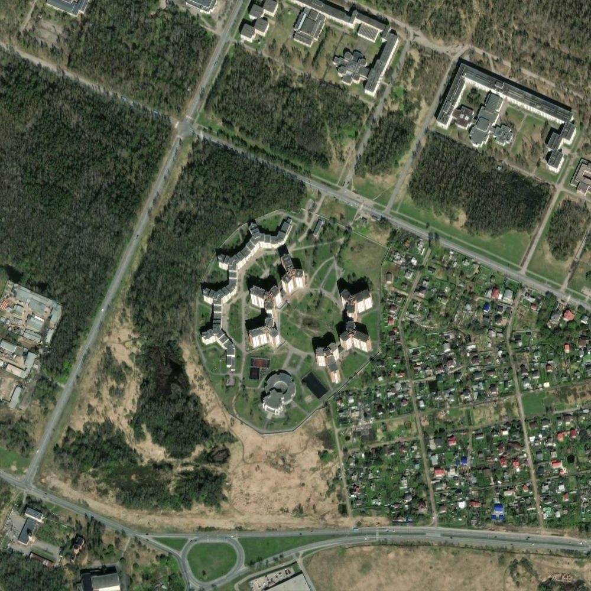
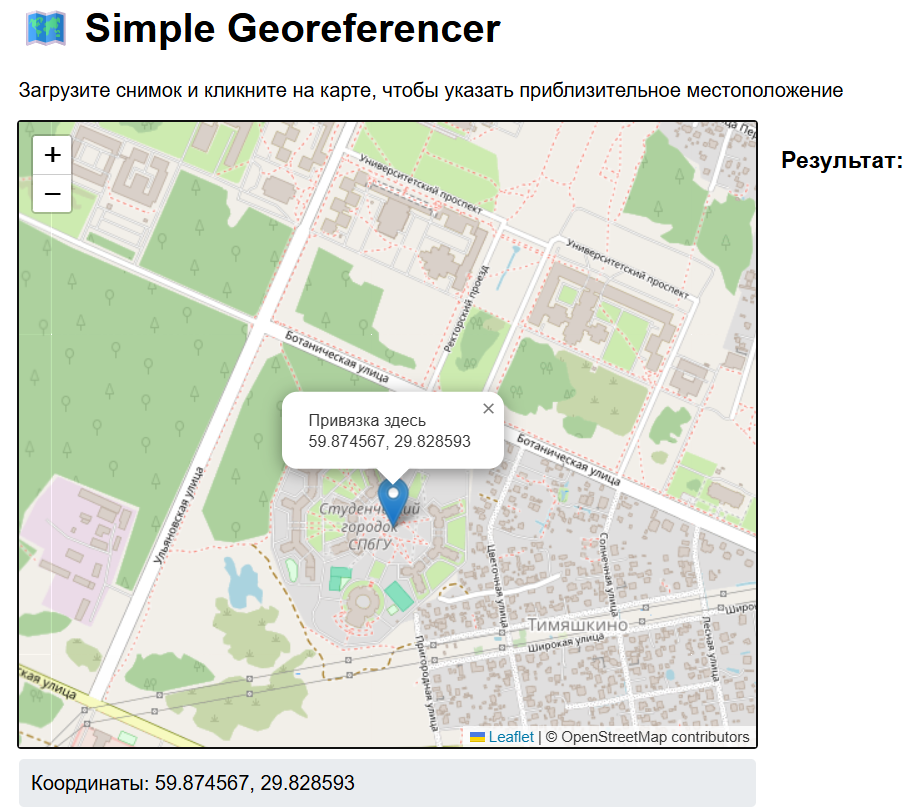
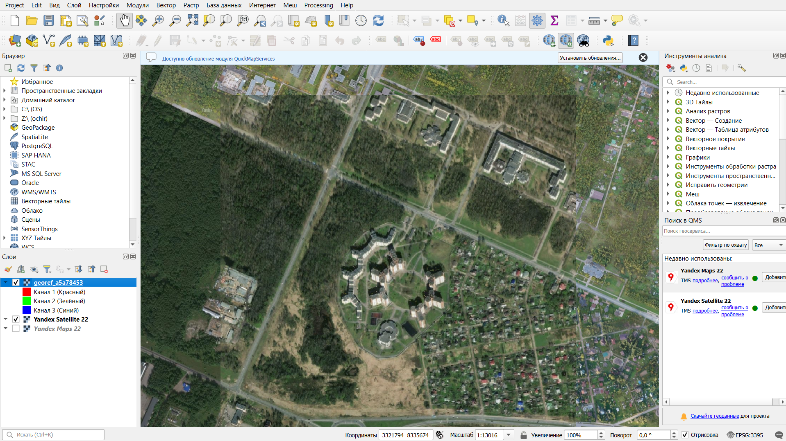

# Полуавтоматическая геопривязка снимков

Простое веб-приложение для полуавтоматической геопривязки снимков.

## Возможности

- Загрузка изображений (JPG, PNG, TIFF)
- Указание приблизительного местоположения кликом на карте
- Автоматическая привязка на основе сопоставления особых точек
- Скачивание результата в формате GeoTIFF

Исходные тайлы для привязки [ArcGIS World Imagery.](https://server.arcgisonline.com/arcgis/rest/services/World_Imagery/MapServer). Обратить внимание на доступные масштабы.

## Запуск через Docker

```bash
docker-compose up -d
```

## Пример работы

Пусть у нас есть непривязанный растр:


Выбираем примерную точку на карте:


После скачивания GEOTiff, можем проверить результат, например в [QGIS](https://qgis.org/):
